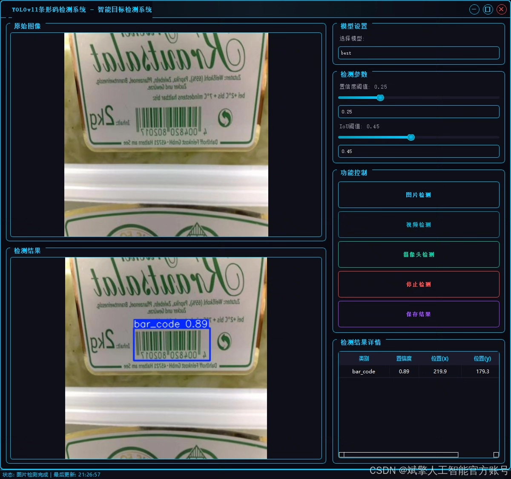
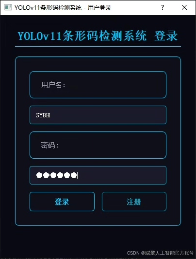
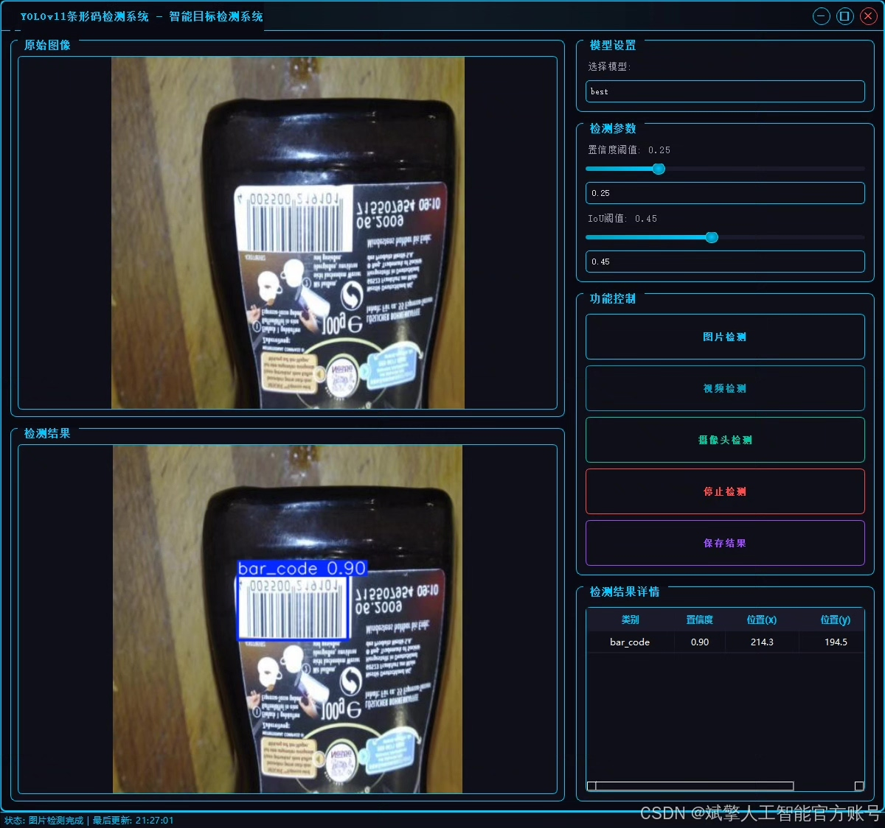
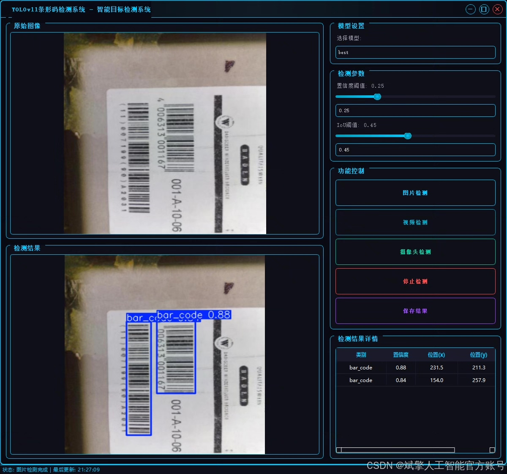
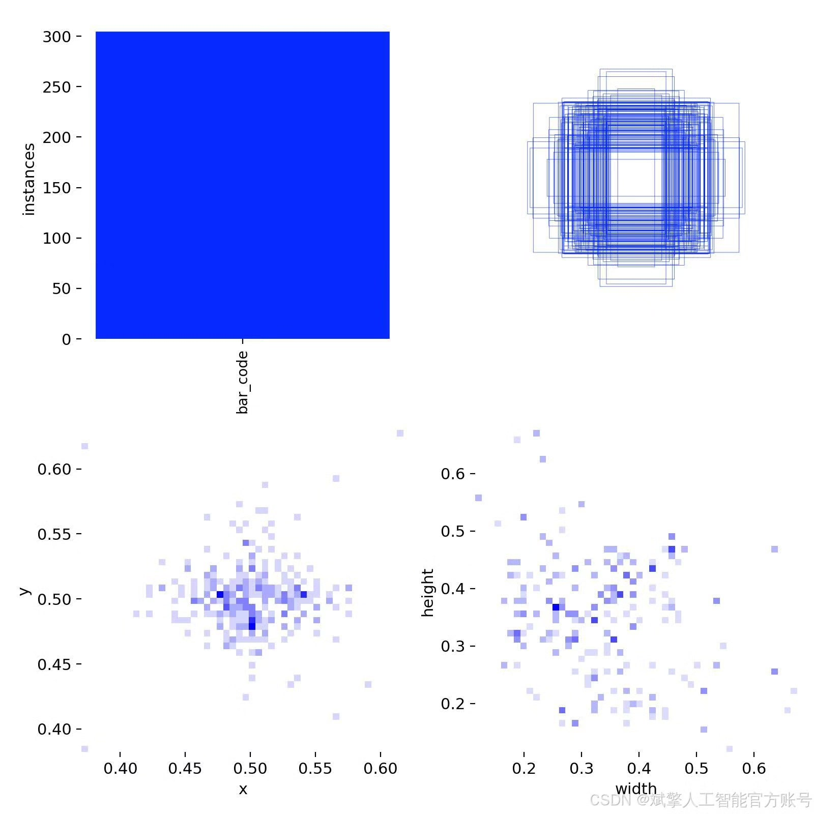
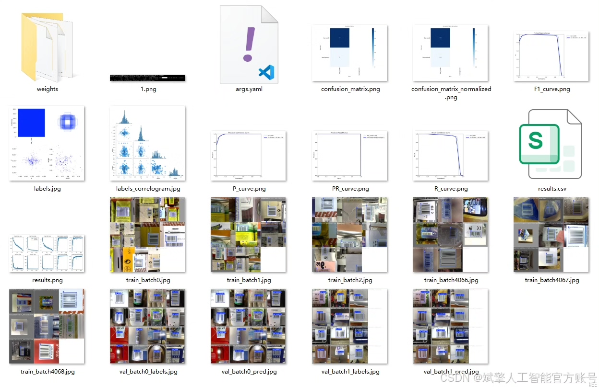
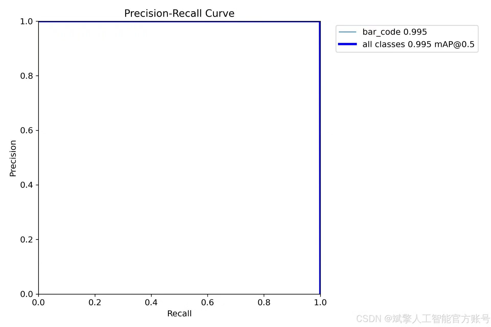
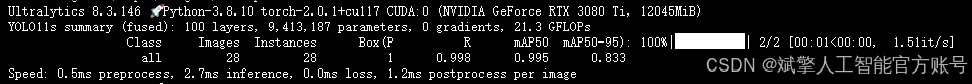
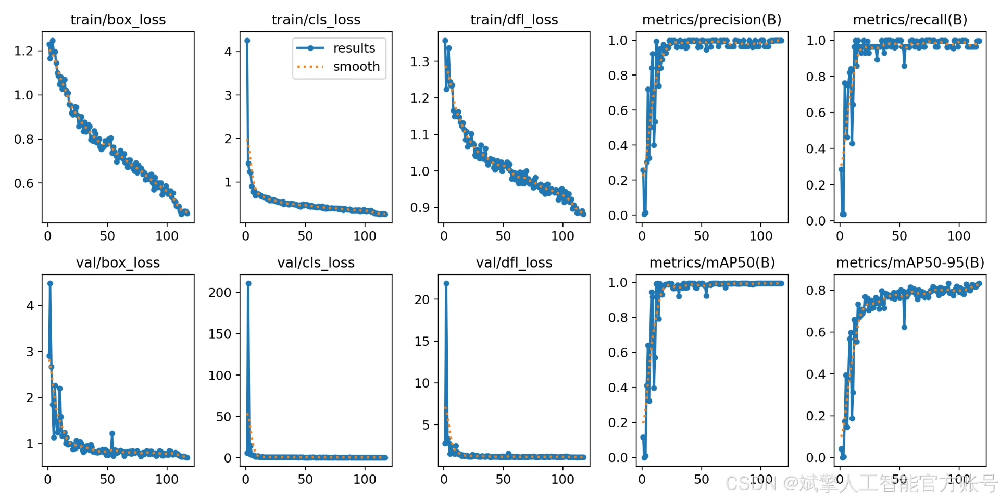

# YOLOv1 barcode detection system

## Body

YOLOv1 is a Region-of-Interest (RoI) object detection model developed by the University of Oxford. It is one of the most popular deep learning models for object detection in real-time applications. The YOLOv1 model has been updated to version 11, which is based on the Darknet architecture and uses a new backbone network called "YOLOv3".

The YOLOv11 model is specifically designed for detecting barcodes, such as QR codes and 2D barcodes. It can accurately recognize and locate barcodes in images with high accuracy and speed. The YOLOv11 model also supports multi-scale detection, which means it can detect barcodes at different sizes and resolutions.

The YOLOv11 model is trained on a large dataset of barcode images, which helps it learn to recognize various types of barcodes. It also uses a combination of convolutional neural networks and fully connected layers to extract features from the input image and classify them into different categories.

Overall, the YOLOv11 barcode detection system is an efficient and accurate tool for recognizing and locating barcodes in real-time applications.

(Full product description was not available from the source page.)

## Images

## Payment

Here is a pay link on Stripe ( https://buy.stripe.com/3cs8yP7sY87d0vu9AB ). Please contact me lonlonago@foxmail.com after funding $89, and I will send you a complete data files , thank you!

